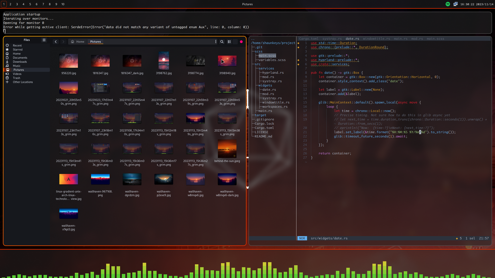

# Hyprdusk

My personalized desktop environment for Hyprland

## Screenshots

There's not a lot to it yet, but this is what I have so far:

## Why make another `X`?

My goal is to have an all-in-one desktop environment built on top of hyprland that is easy to set up. The goal is to have a beautiful, working system out of the box that doesn't require any extra configuration. Certain things will be configurable, like colors, visible workspaces, and visibility of different modules, but full and complete customization is out of scope for this project. Plenty of projects do that quite well already; I want something that just works and looks great without having to learn twenty thousand configuration options and how these 50 applications all fit together. You should be able to `yay -S hyprdusk`, and have a full, complete working hyprland-based desktop environment that looks *great*.

If a part of the environment is not to your satisfaction, it can either be themed using a GTK theme, or if more advanced functionality is needed, it can be forked or disabled and replaced. Once I have an MVP, I will add a configuration system with the ability to do this. There are lots of projects designed to give a completely personalized experience, and alternatives for each module will be documented here.

## Alternatives

This project isn't for everyone. If you want some more knobs to play with, I'd suggest looking into some alternatives. I will try and list my recommendations here so you're not lost when you try to branch out.

* Notification Manager
  * dunst
  * mako
* Status bar
  * Waybar
  * Aylur's GTK Shell (AGS)
    * If you know GTK, this is a great set of tools and provides the greatest customizability. I used this before making Hyprdusk. I would suggest not using an AUR helper for this though, as the API is very unstable and you probably don't want to update it on a regular basis.
  * Ironbar
* Cava panel
  * Unfortunately, I don't know of anything else that integrates cava into the layer shell like this, but there are some status bar plugins that will put it in the status bar. I may be open to branching this into its own project and adding some extra customization options. Time will tell...

## Companions

These are projects that Hyprdusk depends on to make the environment work.

* hyprland
  * The wayland compositor
* hyprpaper
  * The wallpaper daemon
* cava
  * The music visualizer
* alacritty
  * The terminal emulator
* pavucontrol
  * The audio preferences
* blueberry
  * The bluetooth preferences. Originally from Cinnamon DE.
* nautilus
  * File Manager
* eog
  * Image preview
* gnome-calculator
  * Calculator
* gnome-keyring
  * Secrets manager
* wofi
  * Application browser
* wl-clipboard
  * Clipboard manager
* bibata-cursor-theme
  * Cursors
* nm-applet
  * Network management
* wireplumber
  * Volume control & heuristics
* grim
  * Screenshot utility
* slurp
  * Screen coordinate selection utility (for screenshots)
